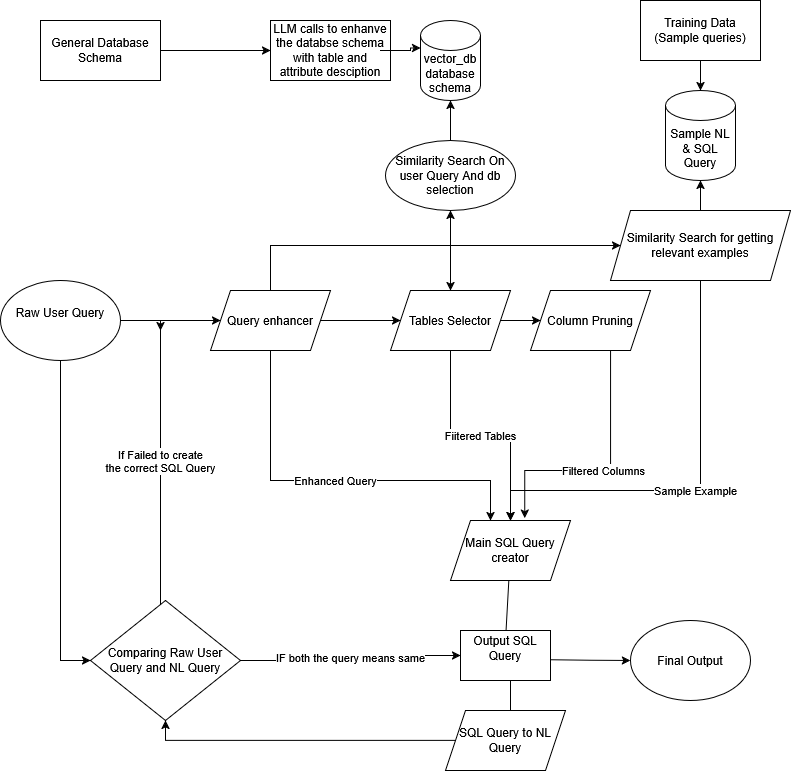

## System Flow Charts

### Complete Flow Chart



### Key Files and Their Functions

- **[database.py](database.py)**: Contains functions to create, list, and delete tables in a PostgreSQL database.
  - `create_tables_from_sql_file(sql_file_path, db_name, user, password, host='localhost', port='5432')`: Creates tables from an SQL file.
  - `list_all_tables(db_name, user, password, host='localhost', port='5432')`: Lists all tables in the database.
  - `get_table_schema(db_name, user, password, host='localhost', port='5432', table_name='')`: Retrieves the schema of a specific table.
  - `delete_all_tables(db_name, user, password, host='localhost', port='5432')`: Deletes all tables in the database.

- **[main.py](main.py)**: Processes NL queries and compares them with expected SQL queries.
  - `process_json_object(nl_query)`: Dummy function to process the NL query.
  - `normalize_string(s)`: Converts a string to lowercase and strips extra spaces.
  - `check_query_match(expected_query, generated_query)`: Compares normalized queries.
  - `process_single_json_object(json_obj)`: Processes a single JSON object and checks if it matches.
  - `process_json_objects(file_path)`: Reads JSON file and returns the list of objects.
  - `process_queries_multithreaded(file_path, max_threads=16)`: Processes queries using multithreading.
  - `process_queries_linear(file_path)`: Processes queries one by one in a linear way.

- **[single_pipeline.py](single_pipeline.py)**: Integrates various components to generate SQL queries from NL inputs.
  - `call_groq_api(api_key, model, messages, temperature=0.0, max_tokens=7000, n=1)`: Calls the Groq API to get a response from the language model.
  - `table_agent(query)`: Determines the relevant tables for a given query.
  - `prune_agent(query)`: Filters the necessary columns for the relevant tables.
  - `final_sql_query_generator(query)`: Generates the final SQL query based on the user query and table schema.

- **[test_schema_embedding.py](test_schema_embedding.py)**: Embeds and searches the database schema using a vector database.
  - `create_vector_db(documents, embedding_model)`: Creates and returns an instance of the vector database.
  - `search_vector_db(vector_store, query, top_k=15)`: Searches the vector database for the most similar documents.
  - `wrapper()`: Creates a vector database instance.

## How to Run

1. **Set Up Environment**:
   - Install the required packages using `pip install -r requirements.txt`.
   - Ensure you have a PostgreSQL database set up and update the connection parameters in `database.py`.

2. **Run the Main Script**:
   - Execute `main.py` to process NL queries and generate SQL queries.

3. **Run the Single Pipeline**:
   - Execute `single_pipeline.py` to integrate the entire process and generate SQL queries from NL inputs.

## Environment Variables

- **GROQ_API_KEY**: API key for the Groq API.

## Example Usage

```python
# Define your database connection parameters
db_name = 'postgres'
user = 'postgres'
password = '12345'
sql_file_path = '/path/to/your/sql_file.sql'

# Create tables from SQL file
create_tables_from_sql_file(sql_file_path, db_name, user, password)

# Process queries
process_queries_multithreaded('D:\\Hackathons\\Adobe\\train_generate_task.json')
process_queries_linear('D:\\Hackathons\\Adobe\\train_generate_task.json')
```

## Performance Metrics

| Metric Type | Component | Performance |
|------------|-----------|-------------|
| Accuracy   | Table Selection | -% |
|            | Column Pruning  | -% |
|            | SQL Generation  | -% |
| Tokens     | Table Selection | ~500 |
|            | Column Pruning  | ~800 |
|            | SQL Generation  | ~1200 |
| Time (sec) | Table Selection | 0.8s |
|            | Column Pruning  | 1.2s |
|            | SQL Generation  | 1.5s |
| **Totals** | Accuracy (avg)  | -% |
|            | Tokens/Query    | ~2500 |
|            | Time/Query      | 3.5s  |


Note: These metrics are based on a test set of 100 queries using Groq API with the LLM-3B model.